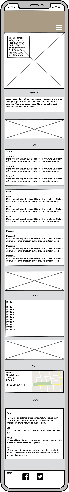
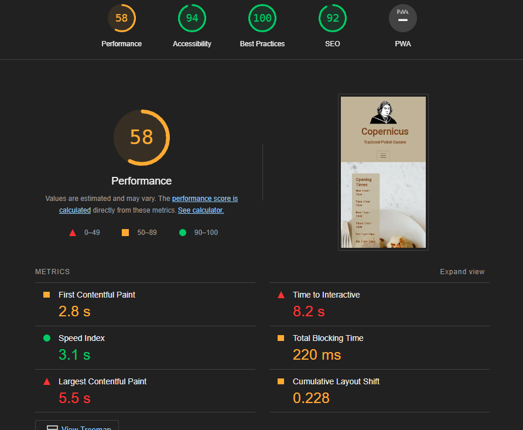
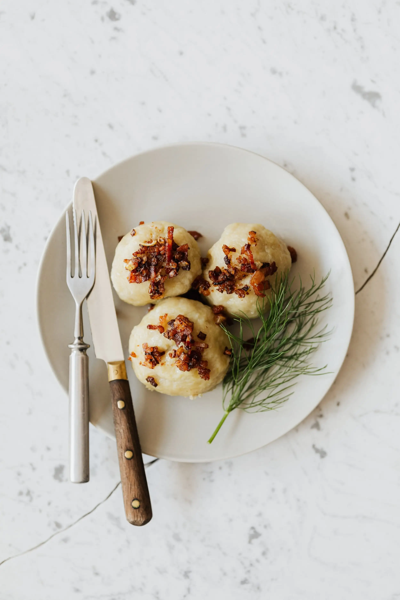
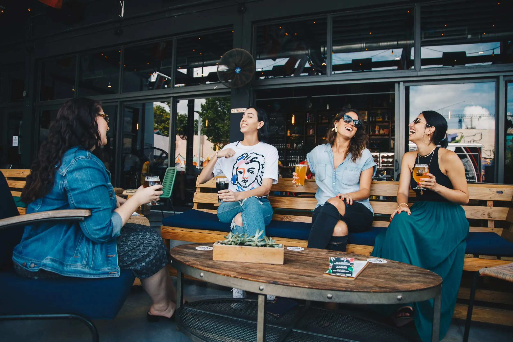
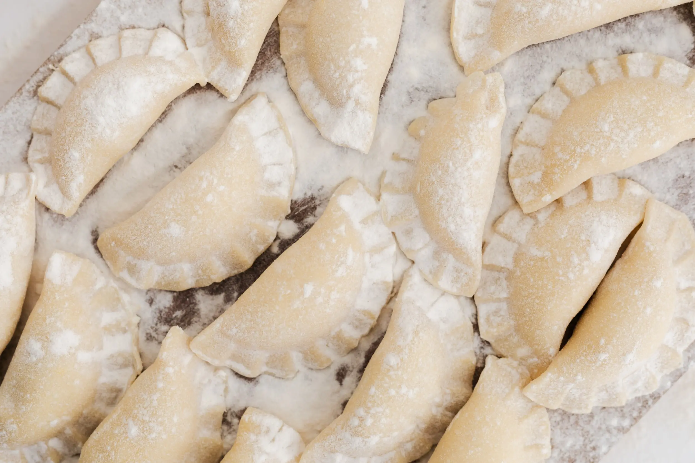

# **Copernicus**
## **Site Overview**
Copernicus is a traditional Polish restaurant, located in Coventry. They are looking for a website being built to create an online presence which will attract customers while informing them of their location, opening times, and its menu.
​
## Table of contents:
1. [**Site Overview**](#site-overview)
1. [**Planning stage**](#planning-stage)
1. [**Features**](#features)
1. [**Future-Enhancements**](#future-enhancements)
1. [**Testing Phase**](#testing-phase)
1. [**Bugs**](#bugs)
1. [**Deployment**](#deployment)
1. [**Tech**](#tech)
1. [**Credits**](#credits)
​
## **Planning stage**
### **Target Audiences:**
​
Copernicus’s target audiences are;   
* Users interested in eating in restaurants
* Users interested in Polish cuisine
* Users interested in activities in Coventry area​

​
### **User Stories:**
​
We envisage that the user will;
* Want to see the content clearly
* Want to navigate the page to find what I require quickly and easily
* Want to learn more about what the business offers
* Want to reach out and contact the business​
* Want to know where the business is located​

​
### **Site Aims:**
​
After talking to the Client, we determined the website should;
* Inform the user on opening times
* Inform the user about what type of cuisine is on offer
* Inform the user on specific menu available
* Inform the user of the location
* Inform the users reviews about the restaurant 
* Inform the users of their Facebook page
* Offer the user an opportunity to get in contact​​

​
​
### **Wireframes:**
​
With input from the client, I came up with these Wireframes and colour Palette
The wireframes was created using Balsamiq, and additional design choices were made during the development process to look better in live environments.

#### Desktop Wireframe: 

#### Mobile Wireframe:

### **Colour Scheme:**
​
The colour scheme was chosen to reflect a homely warm but clean environment where people would like to enjoy a meal.  
The colour palette was created with [coolors.co](https://coolors.co/)

In the end, we only used 4 of the 5 colours available, omitting #AA9B85

​
## **Typography**
​
Throughout the page, the google font Heebo is used with Sans Serif used as a fallback if the browser doesn't support it.
Heebo was chosen for its simple and easy to read design.
​
## **Features**
### **Navigation Bar:**
A common way of navigating a web site that new users will instinctively know how to use

### **Opening Times:**
Shows the opening times of the restaurant 

### **About:**
A small blurb that is concise that lets the user know about the restaurant 

### **Menus:**
What food and drink is available, with its English and Polish names, with a brief description of each course 

### **Loctaction:**
Letter the user know how to find the restaurant with an address and a google map

### **Reviews:**
A few positive reviews telling the user what previous customer thought

### **Contact info:**
A phone number and email address so the client can be contacted

### **Links to social and external review website:**
Links to their Facebook page and Tripadvior score

## **Future-Enhancements**
### **​Polish language option:**
Option to view a polish language version of the website

### **Online booking:**
The ability to reserve a table via an online booking calendar
​
## **Testing Phase**
### **​Responsiveness:**
Chrome dev tools and multiple devices such as android phone, android tablet and iphone, were used to test responsiveness of the website.
### **Functionality:**
Going through each feature one by one i tested;
	Navebar scrolls with page
	Navbar is responsive and turns into a collapsible button 
	Navbar button collapses
	Each link works when clicked 
	Each external link opens up in a new tab
	Google maps allows larger maps
	Google’s larger map opens up in new tab
### **Validators:**
I have used [w3c html validator](https://validator.w3.org/) which spotted a few issues i need to clean up;
* My nabar had a closing tag for an unordered list but no start which i fixed by adding one
* The Bootstrap JavaScript plugin had been place outside of the body element which fixed by moving them to be within the body element
* It has flagged up a polish spelling of a food item because of the site using the “en” Unicode. I’ve ignore as the site is in english and the inclusion of polish words is for menu purposes 
* Flagged up using an % attribute for my width and height for my google maps. But not using it doesn't display properly, so left as is.

I Have used [w3c CSS validator](https://jigsaw.w3.org/css-validator/) with no errors found

I have used the [Lighthouse chrome extension](https://chrome.google.com/webstore/detail/lighthouse/blipmdconlkpinefehnmjammfjpmpbjk?hl=en) to test the performance, accessibility, best practices and SEO. the website performance was quite low at 36/100 so i;
* I compressed all images on site as they caused the most slowdown due to their file size.
* Additionally I converted all the background images from jpeg to webp to help loading times.
In the end i've managed to increase the performance to 58/100

​
​
## **Bugs**

Bugs i have came across;
​
* Navbar not scrolling. This was because of being placed in a container. I move the code for the navbar just below the header.

* Bootstrap row no-gutter class not working. Opted to use bootstraps shorthand for padding 0 which is p-0

* Navbar collapsible button not showing because the colour was not set. Fixed but using the navbar-light class, which is a bootstrap colour

* Home section was too empty when viewed on a medium screen or bigger, so I changed the columns to display on the same row in a medium view. Then changed font size, padding, margins and minimum height in media queries 

* The columns; Starters, Mains, Soft Drinks and Hot drinks did not align correctly when viewed on a medium screen or bigger. So I changed the padding, margins and minimum height in media queries 

* Navbar button not collapsing when pressed. Because there was no javascript linked to. I added  a Bootstrap JavaScript plugin to make this work..​

## **Deployment**
I deployed the page on GitHub pages via the following procedure: -
​
1. From the project's [repository](https://github.com/richard-owen-dev/copernicus), go to the **Settings** tab.
2. From the left-hand menu, select the **Pages** tab.
3. Under the **Source** section, select the **Main** branch from the drop-down menu and click **Save**.
4. A message will be displayed to indicate a successful deployment to GitHub pages and provide the live link.
​
You  can find the live site via the following URL - [live webpage](https://yoururlhere)
***
​
## **Tech**
* HTML & CSS programming languages
* Bootstrap - to easily adapt the website to be responsive for all users
* Google Fonts - Heebo Style
* Font Awesome - Logos for facebook and tripadvisor
* jQuery - Javascript needed for navbar.
* Popper.js - Javascript needed for navbar.
* GitPod - Web based IDE
* GIT - Version Control
* GitHub - to host the repositories for this project and the live website preview
​
## **Credits**
### **Honorable mentions**
​
I would like to thank my mentor Richard Wells for the feedback he has given me during this project

Also i would like to mention Robert Coates whome helped me with any coding question and always pointed me in the right direction
​
### **Content:**
​
Code snippets for the navbar and smoth scrolling where courtesy of my mentor Richard Wells
  
### **Media:**
​
Photo by [Karolina Grabowska](https://www.pexels.com/photo/delicious-potato-dumplings-with-fried-bacon-slices-on-round-plate-4202381/)

Photo by [ELEVATE](https://www.pexels.com/photo/four-women-chatting-while-sitting-on-bench-1267697/)

Photo by [Karolina Grabowska](https://www.pexels.com/photo/freshly-made-pierogi-4084929/)

Image by [Aalmeidah](https://pixabay.com/illustrations/nicolaus-copernicus-illustration-4876963/)
